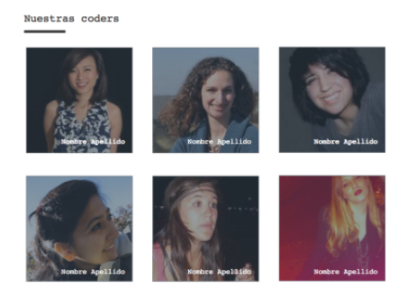
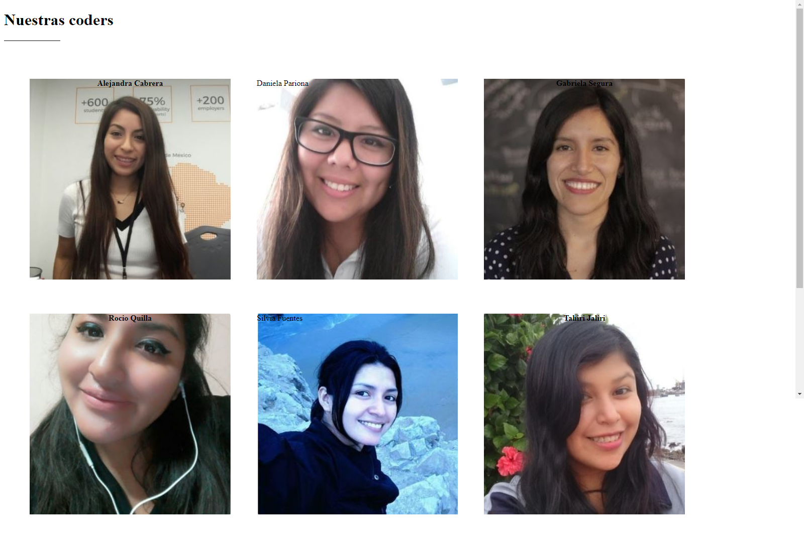
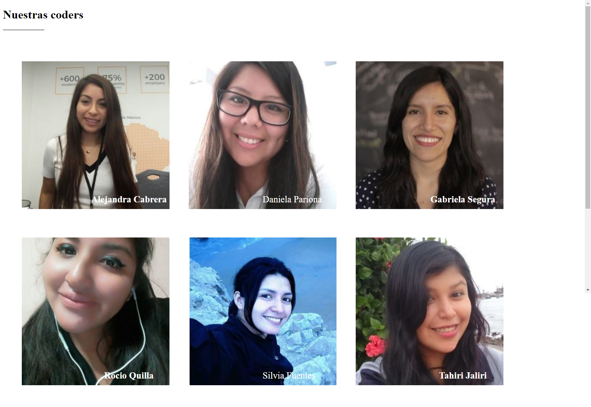

### Proyecto: "Nuestras Coders parte-1" ###

--------------------------------------------------------------

1) __Objetivo__

  Para este proyecto nos indican que debemos ingresar imágenes de las actuales coders de laboratoria ingresando sus nombres y apellidos y nos tiene que quedar de la siguiente manera :

   

  2) __desarrrollo__

  2.1 ***Primera Parte***

  Para empezar realizamos nuestra estructura html en la que  coloqué el título y los nombres de cada coder(dentro de una tabla) por otro lado  en css coloqué las imágenes de cada una ingresando alto y ancho de cada imagen(para lo que se ha colocado una clase a cada celda), lo cual me queda de la siguiente manera :

  

  2.2 ***Segunda Parte***

  como verificamos en la imagen de nuestro objetivo los nombres se encuentran en la parte inferior derecha por lo que en esta parte ingresamos en css la posición de cada imagen y también cambiamos el color de la letra a blanco :
   y es el resultado que queriamos.

  
